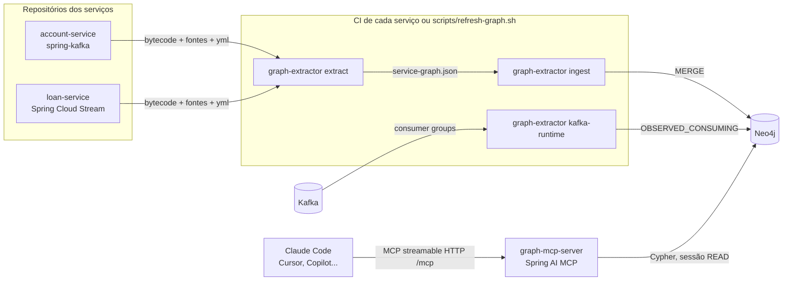
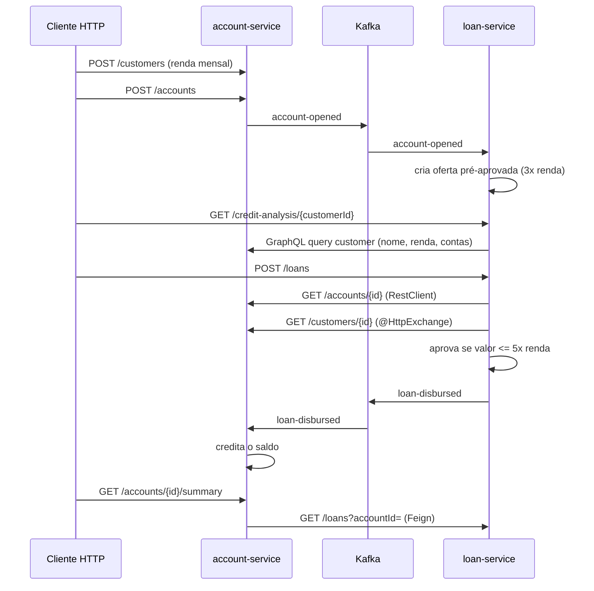

# system-graph-poc

Prova de conceito de **memória compartilhada entre serviços para assistentes de IA**.

Assistentes como Claude Code, Cursor e Copilot enxergam um repositório por vez. Num sistema com vários
serviços que conversam por REST, GraphQL e Kafka, o que mais importa fica *entre* os repositórios: quem chama
qual endpoint, quem consome qual evento, qual formato cada lado espera. Esta POC extrai essas informações do código,
guarda num grafo (Neo4j) e expõe o grafo para qualquer assistente via MCP (Model Context Protocol).

Na prática: um dev abre o `account-service`, pede para renomear um campo de um evento, e o assistente responde
que o `loan-service` quebra, em qual arquivo e em qual linha, sem ninguém ter aberto o outro repositório.

## Conteúdo

A POC está dividida em três repositórios, como seria na empresa:

| Repositório | O que é |
|---|---|
| **system-graph-poc** (este) | Plataforma: extrator, MCP server, templates de CI, scripts e docs |
| [system-graph-account-service](https://github.com/Diegobraun/system-graph-account-service) | Clientes e contas. REST, GraphQL (Spring for GraphQL), spring-kafka e um client Feign para o loan-service |
| [system-graph-loan-service](https://github.com/Diegobraun/system-graph-loan-service) | Empréstimos. Spring Cloud Stream e três clients para o account-service: `RestClient`, `@HttpExchange` e GraphQL |

Conteúdo deste repositório:

| Pasta | O que é |
|---|---|
| [`extractor`](extractor) | CLI Java que lê código compilado, fontes e `application.yml`, gera `service-graph.json` e grava no Neo4j |
| [`graph-mcp-server`](graph-mcp-server) | MCP server em Spring AI que responde perguntas sobre o grafo |
| [`ci`](ci) | Template de GitLab CI que cada serviço inclui para rodar a extração |
| [`scripts`](scripts) | Scripts para subir tudo, atualizar o grafo e rodar a demo |
| [`docs`](docs) | [Arquitetura e decisões](docs/architecture.md), [como levar para a empresa](docs/rollout-gitlab.md), [crawl local](docs/crawl.md) e [fontes experimentais](docs/experimental.md) |

Cada serviço extrai só o próprio código, no próprio CI: o workflow `system-graph` de cada repositório baixa o
`graph-extractor.jar` da [release desta plataforma](https://github.com/Diegobraun/system-graph-poc/releases) e
gera o `service-graph.json` a cada push. O cruzamento entre serviços acontece no grafo central. Veja
[repositórios separados](docs/architecture.md#repositórios-separados).

Sem acesso ao pipeline, o mesmo grafo pode ser montado da máquina do dev com o [`crawl`](docs/crawl.md), que
passa por uma lista de repositórios, faz pull, compila, extrai e grava tudo de uma vez.

## Arquitetura



Três etapas independentes:

1. **Extração** (`extract`): roda depois do `mvn compile`. Lê anotações no bytecode (ClassGraph), cadeias de
   chamada no código-fonte (JavaParser), schemas e documentos GraphQL (graphql-java) e resolve propriedades do
   `application.yml`. Não sobe a aplicação.
2. **Ingestão** (`ingest`): grava o JSON no Neo4j. Cada serviço substitui as próprias relações, então código
   removido some do grafo.
3. **Consulta** (MCP): o assistente chama tools como `impact_of_change` e `service_overview` no meio da tarefa.

Detalhes das regras de extração, do modelo do grafo e das decisões em [docs/architecture.md](docs/architecture.md).

## Fluxo de negócio dos serviços de exemplo



Os dois serviços dependem um do outro: o loan chama o account por REST e GraphQL, e o account chama o loan por
Feign. É o tipo de dependência circular que ninguém lembra que existe até algo quebrar, e aparece direto no grafo
(`DEPENDS_ON` nos dois sentidos).

## Como rodar

Pré-requisitos: Java 21+, Maven 3.9+, Docker.

```bash
git clone https://github.com/Diegobraun/system-graph-poc.git
cd system-graph-poc
scripts/clone-services.sh   # clona os dois serviços como pastas irmãs (../system-graph-*-service)
scripts/start-all.sh        # Kafka + Neo4j no Docker, depois account, loan e MCP server
scripts/refresh-graph.sh    # crawl: pull, compila, extrai, grava no Neo4j e lê os consumer groups
scripts/demo-flow.sh        # executa o fluxo de negócio com curl
```

| O quê | Onde |
|---|---|
| account-service | http://localhost:8081 |
| loan-service | http://localhost:8082 |
| MCP server | http://localhost:8090/mcp |
| Neo4j Browser | http://localhost:7474 (neo4j / password123) |

Para parar: `scripts/stop-all.sh` (só as aplicações) ou `scripts/stop-all.sh --all` (derruba também o Docker).

## Modo local para os seus projetos

O `refresh-graph.sh` roda o `crawl` com o [`crawl.yml`](crawl.yml) desta POC. Para usar com os projetos do
trabalho, basta outro arquivo com a lista (caminho local ou URL do git) e rodar o jar da release:

```bash
java -jar graph-extractor.jar crawl --config ~/work/crawl.yml
```

Projetos Maven multi-módulo e Gradle são detectados sozinhos. O build padrão é `compile` offline primeiro, e
um projeto que falha não impede os outros. Detalhes, formato do arquivo e comparação com o modo CI em
[docs/crawl.md](docs/crawl.md).

Para quando nem compilar dá, ou o código não está disponível, há comandos experimentais separados: extração só
pelo código-fonte, pelo jar publicado no Nexus, importação de OpenAPI e de chamadas vistas pelo APM (Dynatrace ou
um JSON genérico). Ficam fora do caminho principal e estão em [docs/experimental.md](docs/experimental.md).

## O bug que o grafo encontra

Os dois serviços têm, de propósito, uma divergência comum em sistemas sem schema registry. O `account-service`
publica `account-opened` com `accountId, customerId, openedAt`. O `loan-service` lê o mesmo evento esperando
`accountId, customerId, monthlyIncome`, e usa `monthlyIncome` para calcular a oferta pré-aprovada.

Nada quebra em runtime. O Jackson preenche `monthlyIncome` com `null`, e a oferta sai com limite zero. É fácil
ver no passo 3 do `demo-flow.sh`: a cliente tem renda de 8000, o esperado seriam 24000, e chega 0.

O grafo pega isso comparando as classes de payload dos dois lados, cada uma num repositório:

```bash
scripts/mcp-call.sh find_contract_issues
```

```json
{
  "severity": "warning",
  "area": "schema",
  "message": "com.example.loan.messaging.AccountOpenedEvent expects 'monthlyIncome' (BigDecimal) but com.example.account.messaging.AccountOpenedEvent never sends it, so it is always null"
}
```

### GraphQL: validação do documento contra o schema de outro repositório

O loan-service consulta o account-service por GraphQL com o documento
[`customerProfile.graphql`](https://github.com/Diegobraun/system-graph-loan-service/blob/main/src/main/resources/graphql-documents/customerProfile.graphql). O grafo
guarda o schema do servidor e o documento do cliente, e o MCP server valida um contra o outro. Para ver
funcionando, remova `monthlyIncome` do [`schema.graphqls`](https://github.com/Diegobraun/system-graph-account-service/blob/main/src/main/resources/graphql/schema.graphqls),
rode `scripts/refresh-graph.sh` e depois `scripts/mcp-call.sh find_contract_issues`:

```text
error graphql - loan-service sends a GraphQL document that account-service rejects:
  Validation error (FieldUndefined@[customer/monthlyIncome]) : Field 'monthlyIncome' in type 'Customer' is undefined
```

Antes de remover, dá para perguntar quem usa o campo:

```bash
scripts/mcp-call.sh impact_of_change '{"service":"account-service","contract":"Customer.monthlyIncome"}'
```

## Usando com Claude Code

Cada repositório de serviço tem um `.mcp.json` apontando para o MCP server e um `CLAUDE.md` pedindo para
consultar o grafo antes de mexer em contratos. Com tudo rodando:

```bash
cd ../system-graph-account-service
claude
```

Na primeira vez o Claude Code pede para aprovar o servidor `system-graph` do `.mcp.json`. Depois é só trabalhar
normalmente. Trecho resumido de uma resposta real obtida nesta POC, de dentro do `account-service`, para o
pedido *"quero remover o campo monthlyIncome do tipo Customer no GraphQL, renomear GET /customers/{id} para
GET /clients/{id} e mudar o formato da resposta de GET /loans no loan-service; quem quebra, em qual repositório e
arquivo?"*:

> 1. **Remover `Customer.monthlyIncome` do GraphQL**: quebra o **loan-service**, em
>    `src/main/java/com/example/loan/client/CustomerProfileClient.java:20`, que seleciona esse campo na
>    `QUERY customer`. Recomendo marcar com `@deprecated` primeiro e remover depois da migração.
> 2. **Renomear `GET /customers/{id}`**: quebra o **loan-service**, em
>    `src/main/java/com/example/loan/client/CustomerApi.java:10` (confiança média). Há uma nota do time, pendente
>    de confirmação: o loan-service usa o `monthlyIncome` da resposta, multiplicado por 5, para calcular o valor
>    máximo do empréstimo.
> 3. **Mudar a resposta de `GET /loans`**: quebra o **account-service**, em
>    `src/main/java/com/example/account/loan/LoanClient.java:11`, um client Feign (confiança alta).
>
> Os dois serviços dependem um do outro, então cada mudança exige alterar os dois lados.

O assistente estava aberto só no account-service e mesmo assim apontou arquivos do loan-service, que ele não
enxerga. A resposta de cada tool traz o `repository` e o `commitSha` de cada serviço afetado, para abrir o
arquivo no repositório certo.

Outros clientes MCP (Cursor, VS Code com Copilot, Claude Desktop) usam a mesma URL `http://localhost:8090/mcp`.

## Tools do MCP

| Tool | Para quê |
|---|---|
| `list_services` | Serviços conhecidos, commit extraído e contagem de endpoints e tópicos |
| `service_overview` | Tudo sobre um serviço: endpoints e quem chama, chamadas que faz, tópicos, dependentes, notas |
| `impact_of_change` | Quem é afetado, em qual repositório e arquivo, por mudar um endpoint (`GET /accounts/{id}`), evento (`account-opened`), operação GraphQL (`QUERY customer`) ou campo GraphQL (`Customer.monthlyIncome`) |
| `who_consumes` | Produtores, consumidores declarados no código e consumidores observados no Kafka |
| `compare_event_schemas` | Compara campo a campo o payload do produtor e dos consumidores |
| `find_contract_issues` | Varredura geral: endpoint ou operação inexistente, documento GraphQL inválido, tópico sem produtor, payload divergente, consumidor oculto |
| `record_note` | Grava regra de negócio ou pegadinha ligada a serviço, tópico ou endpoint (status `pending`) |
| `graph_model` | Descreve labels, relações e propriedades do grafo |
| `read_cypher` | Cypher livre, somente leitura, limitado a 200 linhas |

Para testar sem assistente: `scripts/mcp-call.sh <tool> '<json>'`, por exemplo
`scripts/mcp-call.sh impact_of_change '{"service":"account-service","contract":"GET /accounts/{id}"}'`.

## Explorando no Neo4j Browser

Abra http://localhost:7474 e rode:

```cypher
MATCH (n) WHERE NOT n:Schema RETURN n
```

```cypher
MATCH (p:Service)-[:PUBLISHES]->(t:Topic)<-[:CONSUMES]-(c:Service)
RETURN p.name AS producer, t.name AS topic, c.name AS consumer
```

```cypher
MATCH (caller:Service)-[r:CALLS]->(e:Endpoint)<-[:EXPOSES]-(owner:Service)
RETURN caller.name, e.method, e.path, owner.name, r.location
```

## Limitações conhecidas

- **Profiles do Spring** são ignorados. Só vale o `application.yml` base (documentos com
  `spring.config.activate.on-profile` são descartados).
- **URL montada em runtime** (`"/accounts/" + id`, `UriComponentsBuilder` complexo) não é resolvida. A chamada
  aparece como dependência de serviço, sem endpoint, ou pode ser declarada no `system-graph.yml`.
- **Clients injetados de outro lugar**: o `baseUrl` é encontrado na própria classe, num `@Bean` com o mesmo
  nome do campo ou no método que chama `createClient(...)`. Configurações mais indiretas precisam do manifesto.
- **`@ImportHttpServices`** (Spring Framework 7 / Boot 4), que define a URL por grupo em propriedades, ainda não
  é lido. O projeto usa Boot 3.5, onde o padrão é `HttpServiceProxyFactory`.
- **Payload aninhado**: a comparação de payload Kafka olha só o primeiro nível de campos do DTO. Em GraphQL a
  validação é completa, porque o schema é explícito.
- **Documento GraphQL montado em runtime** (string concatenada com variáveis Java) não é lido. Documentos em
  arquivo, constantes e text blocks são.
- A comparação de tipos é por nome simples (`Long`, `BigDecimal`), não por compatibilidade de JSON.
- **Um serviço por projeto**: em repositório com várias aplicações, o extrator usa o primeiro
  `spring.application.name` e avisa. Cada módulo de aplicação precisa entrar no `crawl.yml` separado.
- **Kotlin**: as classes compiladas entram, mas o código-fonte Kotlin não é lido (cadeias de `RestClient`,
  `KafkaTemplate` etc. ficam de fora).

## Stack

Spring Boot 3.5.16, Spring Cloud 2025.0.3, Spring AI 1.1.8, Neo4j 5.26 Community, Kafka 3.9 (KRaft),
Spring for GraphQL 1.4, Spring Cloud OpenFeign 4.3, ClassGraph 4.8, JavaParser 3.28, graphql-java 24, Java 21.
