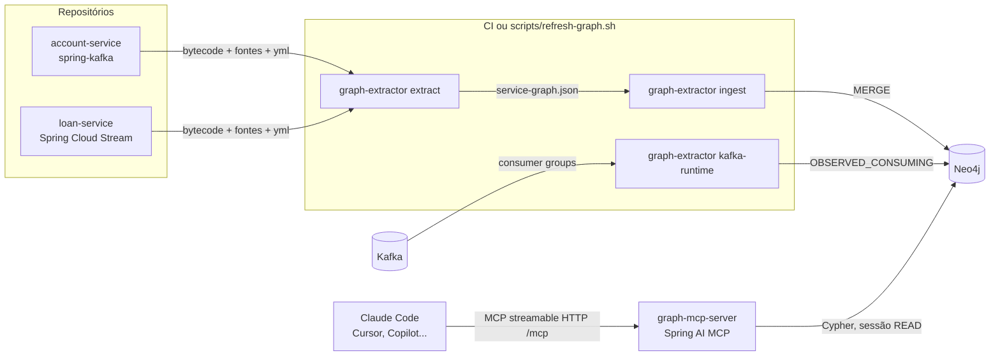
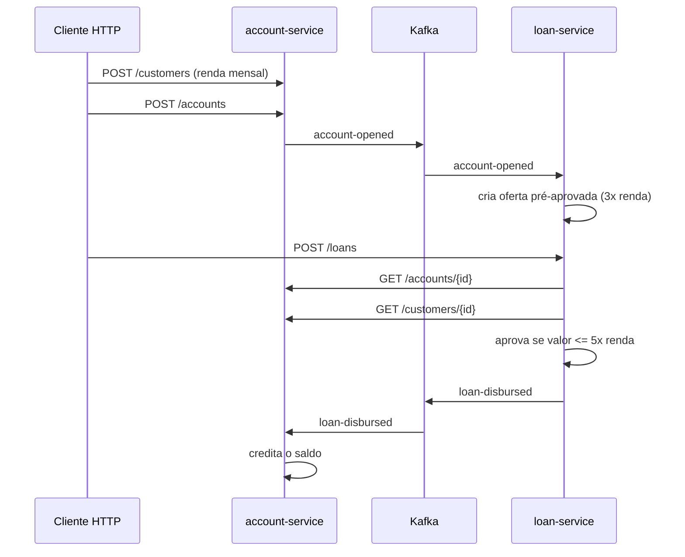

# system-graph-poc

Prova de conceito de **memória compartilhada entre serviços para assistentes de IA**.

Assistentes como Claude Code, Cursor e Copilot enxergam um repositório por vez. Num sistema com vários
serviços que conversam por REST e Kafka, o que mais importa fica *entre* os repositórios: quem chama qual
endpoint, quem consome qual evento, qual formato cada lado espera. Esta POC extrai essas informações do código,
guarda num grafo (Neo4j) e expõe o grafo para qualquer assistente via MCP (Model Context Protocol).

Na prática: um dev abre o `account-service`, pede para renomear um campo de um evento, e o assistente responde
que o `loan-service` quebra, em qual arquivo e em qual linha, sem ninguém ter aberto o outro repositório.

## Conteúdo

| Pasta | O que é |
|---|---|
| [`account-service`](account-service) | Serviço de clientes e contas. Spring Boot + spring-kafka (`KafkaTemplate`, `@KafkaListener`) |
| [`loan-service`](loan-service) | Serviço de empréstimos. Spring Boot + Spring Cloud Stream + `RestClient` chamando o account-service |
| [`extractor`](extractor) | CLI Java que lê código compilado, fontes e `application.yml`, gera `service-graph.json` e grava no Neo4j |
| [`graph-mcp-server`](graph-mcp-server) | MCP server em Spring AI que responde perguntas sobre o grafo |
| [`ci`](ci) | Template de GitLab CI para rodar a extração em cada repositório |
| [`scripts`](scripts) | Scripts para subir tudo, atualizar o grafo e rodar a demo |
| [`docs`](docs) | [Arquitetura e decisões](docs/architecture.md) e [como levar para a empresa](docs/rollout-gitlab.md) |

Os dois serviços ficam no mesmo repositório só por conveniência. Cada um é um projeto Maven independente e
representa um repositório separado no GitLab.

## Arquitetura



Três etapas independentes:

1. **Extração** (`extract`): roda depois do `mvn compile`. Lê anotações no bytecode (ClassGraph), cadeias de
   chamada no código-fonte (JavaParser) e resolve propriedades do `application.yml`. Não sobe a aplicação.
2. **Ingestão** (`ingest`): grava o JSON no Neo4j. Cada serviço substitui as próprias relações, então código
   removido some do grafo.
3. **Consulta** (MCP): o assistente chama tools como `impact_of_change` e `service_overview` no meio da tarefa.

Detalhes das regras de extração, do modelo do grafo e das decisões em [docs/architecture.md](docs/architecture.md).

## Fluxo de negócio dos serviços de exemplo



## Como rodar

Pré-requisitos: Java 21+, Maven 3.9+, Docker.

```bash
scripts/start-all.sh        # Kafka + Neo4j no Docker, depois account, loan e MCP server
scripts/refresh-graph.sh    # compila os serviços, extrai, grava no Neo4j e lê os consumer groups
scripts/demo-flow.sh        # executa o fluxo de negócio com curl
```

| O quê | Onde |
|---|---|
| account-service | http://localhost:8081 |
| loan-service | http://localhost:8082 |
| MCP server | http://localhost:8090/mcp |
| Neo4j Browser | http://localhost:7474 (neo4j / password123) |

Para parar: `scripts/stop-all.sh` (só as aplicações) ou `scripts/stop-all.sh --all` (derruba também o Docker).

## O bug que o grafo encontra

Os dois serviços têm, de propósito, uma divergência comum em sistemas sem schema registry. O `account-service`
publica `account-opened` com `accountId, customerId, openedAt`. O `loan-service` lê o mesmo evento esperando
`accountId, customerId, monthlyIncome`, e usa `monthlyIncome` para calcular a oferta pré-aprovada.

Nada quebra em runtime. O Jackson preenche `monthlyIncome` com `null`, e a oferta sai com limite zero. É fácil
ver no passo 3 do `demo-flow.sh`: a cliente tem renda de 8000, o esperado seriam 24000, e chega 0.

O grafo pega isso comparando as classes de payload dos dois lados:

```bash
scripts/mcp-call.sh find_contract_issues
```

```json
{
  "severity": "warning",
  "area": "schema",
  "message": "com.example.loan.messaging.AccountOpenedEvent expects 'monthlyIncome' (BigDecimal) but com.example.account.messaging.AccountOpenedEvent never sends it, so it is always null"
}
```

## Usando com Claude Code

Cada serviço tem um `.mcp.json` apontando para o MCP server e um `CLAUDE.md` pedindo para consultar o grafo antes
de mexer em contratos. Com tudo rodando:

```bash
cd account-service
claude
```

Na primeira vez o Claude Code pede para aprovar o servidor `system-graph` do `.mcp.json`. Depois é só trabalhar
normalmente. Trecho resumido de uma resposta real obtida nesta POC para o pedido *"quero remover customerId do AccountOpenedEvent e
renomear GET /customers/{id} para GET /clients/{id}, quem quebra?"*, feito de dentro do `account-service`:

> Nos dois casos quem quebra é o **loan-service**. É o único dependente do account-service.
>
> **1. Remover `customerId` do `AccountOpenedEvent`**: mudança incompatível, porque o consumidor declara
> `customerId` (Long) e passa a receber sempre `null`. Afetados: `com.example.loan.messaging.AccountOpenedEvent`
> e `AccountOpenedConsumer#accountOpened:13`. Problema que já existe hoje: o loan-service espera
> `monthlyIncome` nesse evento, mas o account-service nunca envia esse campo, então ele chega sempre `null`.
>
> **2. Renomear `GET /customers/{id}`**: o loan-service chama o path antigo e passa a receber 404. Afetado:
> `loan-service/src/main/java/com/example/loan/client/AccountClient.java:24`. Nota do time (pendente de
> confirmação): o loan-service usa `monthlyIncome` da resposta, multiplicado por 5, para calcular o valor
> máximo do empréstimo.

Outros clientes MCP (Cursor, VS Code com Copilot, Claude Desktop) usam a mesma URL `http://localhost:8090/mcp`.

## Tools do MCP

| Tool | Para quê |
|---|---|
| `list_services` | Serviços conhecidos, commit extraído e contagem de endpoints e tópicos |
| `service_overview` | Tudo sobre um serviço: endpoints e quem chama, chamadas que faz, tópicos, dependentes, notas |
| `impact_of_change` | Quem é afetado por mudar um endpoint (`GET /accounts/{id}`) ou evento (`account-opened`) |
| `who_consumes` | Produtores, consumidores declarados no código e consumidores observados no Kafka |
| `compare_event_schemas` | Compara campo a campo o payload do produtor e dos consumidores |
| `find_contract_issues` | Varredura geral: endpoint inexistente, tópico sem produtor, schema divergente, consumidor oculto |
| `record_note` | Grava regra de negócio ou pegadinha ligada a serviço, tópico ou endpoint (status `pending`) |
| `graph_model` | Descreve labels, relações e propriedades do grafo |
| `read_cypher` | Cypher livre, somente leitura, limitado a 200 linhas |

Para testar sem assistente: `scripts/mcp-call.sh <tool> '<json>'`, por exemplo
`scripts/mcp-call.sh impact_of_change '{"service":"account-service","contract":"GET /accounts/{id}"}'`.

## Explorando no Neo4j Browser

Abra http://localhost:7474 e rode:

```cypher
MATCH (n) WHERE NOT n:Schema RETURN n
```

```cypher
MATCH (p:Service)-[:PUBLISHES]->(t:Topic)<-[:CONSUMES]-(c:Service)
RETURN p.name AS producer, t.name AS topic, c.name AS consumer
```

```cypher
MATCH (caller:Service)-[r:CALLS]->(e:Endpoint)<-[:EXPOSES]-(owner:Service)
RETURN caller.name, e.method, e.path, owner.name, r.location
```

## Limitações conhecidas

- **Profiles do Spring** são ignorados. Só vale o `application.yml` base (documentos com
  `spring.config.activate.on-profile` são descartados).
- **URL montada em runtime** (`"/accounts/" + id`, `UriComponentsBuilder` complexo) não é resolvida. A chamada
  aparece como dependência de serviço, sem endpoint, ou pode ser declarada no `system-graph.yml`.
- **Clients injetados de outro lugar**: o `baseUrl` é encontrado na própria classe ou num `@Bean` com o mesmo
  nome do campo. Configurações mais indiretas precisam do manifesto.
- **Payload aninhado**: a comparação de schema olha só o primeiro nível de campos do DTO.
- **HTTP Interfaces** (`@HttpExchange`) ainda não são lidas. São o próximo passo natural, porque tornam a extração
  de chamadas REST exata.
- A comparação de tipos é por nome simples (`Long`, `BigDecimal`), não por compatibilidade de JSON.

## Stack

Spring Boot 3.5.16, Spring Cloud 2025.0.3, Spring AI 1.1.8, Neo4j 5.26 Community, Kafka 3.9 (KRaft),
ClassGraph 4.8, JavaParser 3.28, Java 21.
