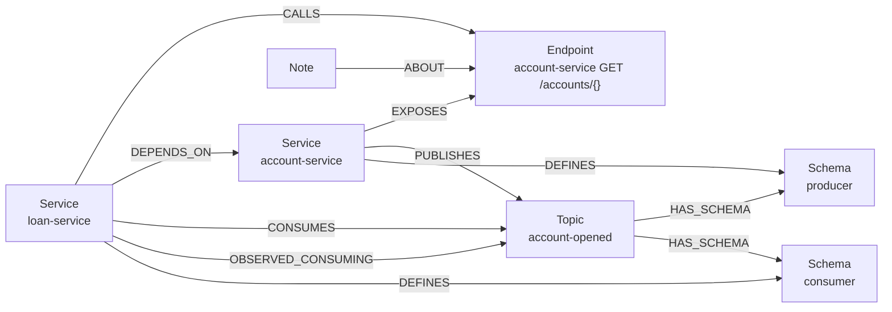

# Arquitetura e decisões

## Duas camadas de memória

O grafo guarda dois tipos de informação, com origens e confiabilidade diferentes.

**Estrutura (derivada do código).** Serviços, endpoints, chamadas REST, tópicos Kafka, payloads. Ninguém
escreve isso à mão: o extrator gera a cada build. Se o código muda, o grafo muda junto.

**Conhecimento (escrito por pessoas e pela IA).** Regras de negócio, decisões e pegadinhas que não aparecem no
código, ou aparecem de forma espalhada. Ficam em nós `Note` ligados ao elemento a que se referem. Entram com
status `pending` e alguém do time aprova ou descarta. Uma nota ligada a `account-service GET /customers/{id}`
aparece para quem estiver mexendo nesse endpoint no account-service e também para quem estiver mexendo no
client que chama esse endpoint no loan-service.

## Modelo do grafo

| Nó | Chave | Propriedades |
|---|---|---|
| `Service` | `name` (= `spring.application.name`) | `indexed`, `repository`, `commitSha`, `extractedAt`, `ingestedAt`, `graphqlSchema` |
| `Endpoint` | `key` = `serviço MÉTODO /path/{}` ou `serviço QUERY campo` | `service`, `method`, `path`, `protocol` (`http`, `graphql`) |
| `Topic` | `name` | |
| `Schema` | `key` = `serviço\|tópico\|lado\|classe` | `side` (producer, consumer), `className`, `fieldNames[]`, `fieldTypes[]` |
| `Note` | `id` | `text`, `author`, `status`, `createdAt` |

| Relação | Propriedades |
|---|---|
| `EXPOSES` | `handler` (classe#método:linha) |
| `CALLS` | `via`, `location` (arquivo:linha), `confidence`, `source`, `baseUrl`, `document` (GraphQL) |
| `DEPENDS_ON` | `source` |
| `PUBLISHES` / `CONSUMES` | `via`, `payloadType`, `location`, `source`; `CONSUMES` também tem `group` |
| `OBSERVED_CONSUMING` | `activeMembers`, `state`, `observedAt` |

Operações GraphQL também são `Endpoint`: cada campo raiz de `Query`, `Mutation` e `Subscription` vira
`account-service QUERY customer`. Assim `CALLS`, `impact_of_change` e `find_contract_issues` tratam HTTP e
GraphQL do mesmo jeito, e o que é específico de GraphQL (schema e documento) fica em propriedades.

A chave do endpoint normaliza variáveis de path: `/accounts/{id}` e `/accounts/{accountId}` viram
`/accounts/{}`. É isso que liga o `CALLS` de um serviço ao `EXPOSES` do outro, mesmo com nomes de variável
diferentes.

O nome do serviço é o identificador universal. Ele vem do `spring.application.name` e é o mesmo usado como
`group.id` no Kafka, o que permite cruzar o que o código declara com o que o cluster mostra.

## Regras de extração

O extrator usa duas técnicas. ClassGraph lê o bytecode em `target/classes` e cobre tudo que é declarado por
anotação (as constantes já chegam resolvidas pelo compilador). JavaParser lê `src/main/java` e cobre o que é
chamada de método, que não existe no bytecode de forma fácil de interpretar.

| Padrão no código | Vira | Como é lido |
|---|---|---|
| `@RestController` + `@GetMapping` etc. | `EXPOSES` | ClassGraph: path da classe + path do método |
| `restClient.get().uri("/x/{id}")` | `CALLS` | JavaParser: verbo da cadeia, path literal ou constante |
| `webClient.post().uri(...)` | `CALLS` | Igual ao `RestClient` |
| interface `@HttpExchange` + `@GetExchange` etc. | `CALLS` | ClassGraph lê as anotações; JavaParser acha o `createClient(X.class)` e o `baseUrl` do client usado |
| interface `@FeignClient(name, url, path)` + `@GetMapping` etc. | `CALLS` | ClassGraph; serviço alvo pelo `name`, conferido com a `url` quando existe |
| `schema.graphqls` em `resources/graphql` + `@QueryMapping` etc. | `EXPOSES` (GraphQL) | graphql-java lê o SDL (inclusive `extend type`); ClassGraph liga cada campo raiz ao método que o resolve |
| `graphQlClient.document(...)` / `.documentName(...)` | `CALLS` (GraphQL) | JavaParser acha a chamada e o `baseUrl`; o documento vem do literal, da constante ou de `resources/graphql-documents` |
| `builder.baseUrl(url)` com `@Value("${...}")` | serviço alvo | JavaParser + resolução no `application.yml` |
| `@KafkaListener(topics = "${...}")` | `CONSUMES` | ClassGraph + resolução de placeholder; tipo do payload pelo parâmetro |
| `kafkaTemplate.send(Topics.X, key, event)` | `PUBLISHES` | JavaParser: tópico por constante, literal ou `@Value`; payload pelo argumento ou pelo genérico do `KafkaTemplate` |
| `@Bean Consumer<T>` / `Function<T,R>` / `Supplier<R>` | `CONSUMES` / `PUBLISHES` | ClassGraph + bindings `<nome>-in-0` / `<nome>-out-0` no yml |
| `streamBridge.send("binding", payload)` | `PUBLISHES` | JavaParser: binding resolvido para `destination` no yml |
| campos do DTO de payload | `Schema` | ClassGraph: campos não estáticos da classe ou record |
| `system-graph.yml` | qualquer relação | Manifesto para o que a análise não pega |

### Como o serviço alvo de uma chamada é descoberto

O campo `via` de cada `CALLS` diz de onde a chamada veio: `rest-client`, `web-client`, `http-exchange`, `feign`,
`graphql` ou `manifest`.

Para Feign, o `name` do `@FeignClient` já é o nome lógico do serviço. Se houver `url`, ela é resolvida pelos
passos abaixo. Quando os dois batem, a confiança é `high`.

Para os demais:

1. Acha o `baseUrl(...)` do client: na atribuição do campo dentro da classe, no inicializador do campo, num
   método `@Bean` com o mesmo nome do campo ou, para `@HttpExchange`, no método que chama
   `createClient(Interface.class)` (inclusive quando o `RestClient` vem de outro `@Bean` via `@Qualifier`). Para
   GraphQL, também vale a `url(...)` do builder quando ela é absoluta.
2. Resolve o valor. Se for `@Value("${services.account-service.url}")`, busca no `application.yml`.
3. Se o host da URL for um nome (`http://account-service:8080`, `account-service.core.svc`), esse é o serviço.
   Confiança `high`.
4. Se o host for `localhost` ou IP (comum em dev), usa a convenção do nome da propriedade:
   `services.<serviço>.url`, `<serviço>.base-url` e variações. Confiança `medium`.
5. Se nada funcionar, a chamada fica como `unknown`, o extrator avisa, e ela pode ir para o manifesto.

Esse passo 4 é o motivo de valer a pena padronizar o nome das propriedades de URL nos serviços da empresa.

## GraphQL

O schema é a especificação do contrato, então aqui o grafo vai mais longe que em REST e Kafka.

- O extrator do **servidor** guarda o SDL inteiro em `Service.graphqlSchema`.
- O extrator do **cliente** guarda o documento de cada chamada em `CALLS.document`.
- O **MCP server** valida o documento contra o schema com graphql-java (as mesmas regras que o servidor aplica
  em runtime) e percorre a seleção para saber exatamente quais campos cada cliente usa.

Com isso dá para perguntar `impact_of_change` para um campo, como `Customer.monthlyIncome`, e receber só os
clientes que selecionam aquele campo. Remover um campo que ninguém usa é seguro, e o grafo diz isso.

A validação fica no MCP server, não no extrator, porque cliente e servidor estão em repositórios diferentes. O
extrator do loan-service não tem acesso ao schema do account-service.

## Repositórios separados

Na empresa, cada serviço tem seu repositório, e esta POC está organizada do mesmo jeito:
[account-service](https://github.com/Diegobraun/system-graph-account-service), [loan-service](https://github.com/Diegobraun/system-graph-loan-service) e a plataforma. O desenho parte disso:

| Onde | O que roda | O que enxerga |
|---|---|---|
| CI de cada serviço | `extract` e `ingest` | só o próprio código e config |
| Neo4j central | o grafo | todos os serviços que já rodaram o job |
| MCP server central | tools, validação GraphQL, comparação de payload | o grafo inteiro |
| Máquina do dev | Claude Code, Cursor, Copilot | o repositório aberto + o MCP |

Tudo que depende de cruzar dois serviços é feito depois da ingestão: ligar `CALLS` a `EXPOSES` pela chave do
endpoint, comparar payload de produtor e consumidor, validar documento GraphQL contra schema. Nenhum
repositório precisa de acesso ao código de outro.

Como o assistente só vê o repositório aberto, cada `Service` guarda `repository` (vem de `CI_PROJECT_URL` no
GitLab ou do `git remote` local) e `commitSha`. As respostas de impacto trazem repositório, commit e
`arquivo:linha` de cada serviço afetado, para o dev ou o assistente abrir o lugar certo no outro repositório.

A adoção também pode ser gradual. Um serviço que ainda não tem o job aparece como `indexed: false` quando alguém o
chama, e as tools deixam isso explícito.

## Ingestão

Cada `service-graph.json` é gravado numa transação. Primeiro apaga todas as relações de saída do serviço
(`EXPOSES`, `CALLS`, `DEPENDS_ON`, `PUBLISHES`, `CONSUMES`) e os `Schema` dele, depois recria a partir do JSON.
Com isso, um `@KafkaListener` removido do código some do grafo no próximo build, sem acumular lixo.

`Endpoint` e `Topic` são compartilhados entre serviços e só são removidos quando ficam sem nenhuma relação. Notas
seguram o nó: um endpoint com nota não some mesmo que o dono pare de expor. Isso é proposital, porque a nota
pode ser justamente "este endpoint foi descontinuado em tal data".

Serviços referenciados mas nunca extraídos (um client chamando um serviço que ainda não tem o job de CI) viram
`Service {indexed: false}`. As tools deixam isso claro para o assistente não tirar conclusão errada.

`OBSERVED_CONSUMING` vem de outra fonte (o `AdminClient` do Kafka) e nunca é apagado pela ingestão do código.
O comando `kafka-runtime` substitui essas relações inteiras a cada execução.

## MCP server

### Tools de domínio e Cypher livre

As perguntas frequentes (impacto, visão geral, consumidores, schema) viraram tools com Cypher fixo. A resposta é
previsível, rápida e já vem no formato que o assistente precisa, inclusive com orientação (`guidance`) sobre o
que é mudança compatível e o que quebra.

`read_cypher` fica para o resto. O assistente chama `graph_model` para ver o schema e escreve a query. É útil
para perguntas que ninguém previu, como "quais serviços consomem mais de dois tópicos".

### Somente leitura

As sessões de leitura abrem com `AccessMode.READ`. O Neo4j rejeita qualquer escrita nesse modo, mesmo em
instância única, com `Writing in read access mode not allowed`. Isso foi testado nesta POC. Também há timeout
de 5 segundos por query e limite de 200 linhas.

Só `record_note` escreve, com uma query fixa que cria a nota. Em produção, o ideal é somar a isso um usuário
Neo4j só de leitura para o MCP. Controle de acesso por papéis (RBAC) só existe no Neo4j Enterprise ou no Aura;
na Community a proteção é o modo de acesso da sessão.

### Transporte

Streamable HTTP em `/mcp`, que é o transporte atual do protocolo. Um servidor central atende todos os devs, sem
nada para instalar na máquina de cada um. As `instructions` do servidor já dizem ao assistente quando usar cada
tool, e o `CLAUDE.md` de cada repositório reforça.

## Segurança

O grafo descreve a arquitetura inteira: nomes de serviços, endpoints internos, tópicos. Em produção:

- MCP server atrás de autenticação (token por dev ou OAuth pelo GitLab), só na rede interna.
- Nada de dados de negócio no grafo. Só estrutura e notas técnicas.
- Notas passam por revisão antes de virar `approved`, para não virar canal de informação errada.
