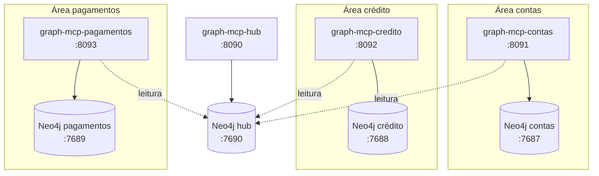
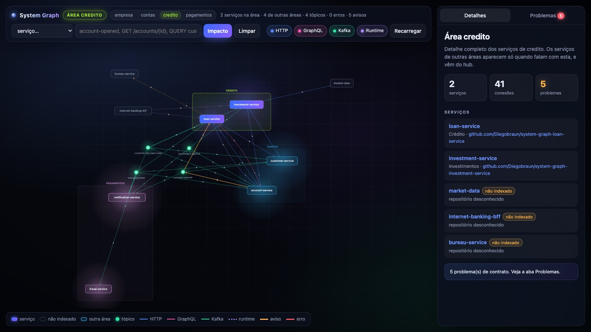
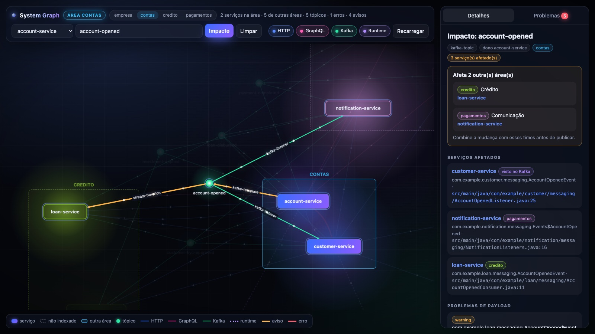
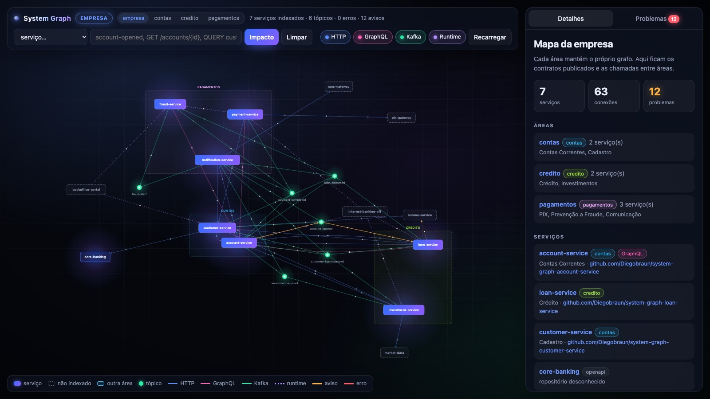

# Grafo por área

Num banco grande, um grafo único com todos os serviços da empresa vira um problema de governança antes de virar
um problema técnico: quem é dono, quem pode escrever, quem vê o quê. A POC separa o grafo por área de negócio
(contas, crédito, pagamentos, e na empresa seriam core banking, arrecadação, cadastro...) e mantém um grafo
central, o **hub**, só com o que atravessa as fronteiras.



## O que fica em cada grafo

| | Grafo da área | Hub |
|---|---|---|
| Serviços | os da área, com código | todos, com `area` e `team` |
| Endpoints, operações GraphQL, tópicos, schemas | os da área e os que ela usa | todos os publicados |
| `CALLS`, `PUBLISHES`, `CONSUMES` | tudo, inclusive dentro da área | publicações, consumos e só as chamadas que saem da área |
| Chamadas observadas (APM) | as que envolvem serviços da área | todas |
| Notas | as da área | - |

A regra é: detalhe fica na área, fronteira fica no hub. Uma chamada do account-service para o customer-service
(ambos de contas) só existe no grafo de contas. Uma chamada do loan-service (crédito) para o account-service
(contas) vai para o grafo de crédito e para o hub.

Cada `Service` ganha as propriedades `area` e `team` e a relação `(:Service)-[:IN_AREA]->(:Area)`.

## Como o grafo é montado

Cada área tem o próprio arquivo de crawl em [`areas/`](../areas), com a área, o time padrão e as duas conexões:

```yaml
area: contas
team: Contas Correntes

neo4j:
  uri: bolt://localhost:7687
hub:
  uri: bolt://localhost:7690

projects:
  - git: https://github.com/Diegobraun/system-graph-account-service.git
  - git: https://github.com/Diegobraun/system-graph-customer-service.git
    team: Cadastro
```

O `crawl` grava tudo no Neo4j da área e depois exporta para o hub os contratos e as chamadas que saem da área.
No modo CI é o mesmo `ingest`, com a área e o hub na linha de comando:

```bash
java -jar graph-extractor.jar ingest target/service-graph.json \
  --area contas --team "Contas Correntes" --hub-uri bolt://hub:7687
```

Sem `hub`, o comportamento é o de antes: um grafo só.

## Como o MCP responde

Cada área roda o próprio `graph-mcp-server` com `GRAPH_AREA` e `GRAPH_HUB_URI`. As tools consultam o grafo da
área e completam com o hub:

- `impact_of_change` de um contrato de contas traz os afetados de dentro de contas (do grafo local) e os de
  outras áreas (do hub), com `affectedAreas` listando área, times e serviços. O assistente usa isso para dizer
  "combine com o time Crédito antes de publicar".
- `service_overview` de um serviço de outra área responde pelo hub, só com a fronteira, e avisa que o detalhe
  está no grafo daquela área.
- `find_contract_issues` mostra os problemas que envolvem a área: os internos, que só ela vê, e os de fronteira,
  que vêm do hub.
- `list_areas` lista as áreas, os times e quantos contratos de cada área são usados por outras.

O MCP do hub (sem `GRAPH_AREA`) é a visão da empresa: todos os serviços, só as conexões entre áreas.

## Interface

[](img/demo.mp4)

A interface de cada área desenha os serviços agrupados em caixas por área, com a área da casa em destaque e os
serviços de outras áreas que se conectam com ela em volta. Os links no topo trocam entre as instâncias.



No impacto, o painel mostra quais outras áreas e times precisam ser avisados:



O hub mostra a empresa inteira:



## Na empresa

- Cada área tem o próprio Neo4j e decide quem escreve nele. O hub recebe escrita só dos pipelines, com um
  usuário por área.
- O Neo4j Community aceita um banco por instância, por isso um container por área. Com Enterprise daria para
  usar um banco por área na mesma instância.
- O que uma área publica no hub é o que ela oferece para as outras. Chamada interna, nota e detalhe de
  implementação não saem da área.
- O dev configura no `.mcp.json` do repositório o MCP da própria área.

## Voltando para um grafo só

Tudo isso está na branch `areas`. A `main` continua com o grafo único.
