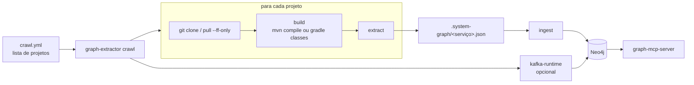

# Modo local: crawl dos seus projetos

O caminho "ideal" da POC é cada serviço rodar a extração no próprio CI. Em empresa grande nem sempre dá para
mexer no pipeline. O `crawl` resolve isso do lado de quem tem acesso de leitura aos repositórios: roda na
máquina do dev, passa por uma lista de projetos, atualiza, compila, extrai e grava tudo no Neo4j de uma vez.

O grafo gerado é o mesmo do modo CI. O MCP server e as tools não mudam.



## Uso

```bash
java -jar graph-extractor.jar crawl --config crawl.yml
```

| Opção | Efeito |
|---|---|
| `--config arquivo` | Arquivo de configuração. Padrão `crawl.yml` no diretório atual |
| `--only a,b` | Roda só os projetos com esses nomes |
| `--no-pull` | Não faz `git pull`, usa o que está no disco |
| `--no-build` | Não compila, usa o `target/classes` que já existe |
| `--no-ingest` | Só gera os JSONs, não grava no Neo4j |
| `--neo4j-uri`, `--neo4j-user`, `--neo4j-password` | Conexão, igual aos outros comandos |

Nesta POC, `scripts/refresh-graph.sh` é só um atalho para `crawl --config crawl.yml`.

Saída de exemplo:

```text
[1/2] system-graph-account-service
      ok: local (2.4s)
[2/2] system-graph-loan-service
      ok: local (1.7s)

project                      service                    status          endpoints  calls  pubs  subs
system-graph-account-service account-service            ok                      7      1     1     1
system-graph-loan-service    loan-service               ok                      5      3     1     1

2 of 2 projects extracted

ingested account-service (5f46a9e)
ingested loan-service (8b0377a)
loan-service -> account-opened (1 active members, Stable)
account-service -> loan-disbursed (1 active members, Stable)
```

Um projeto que falha (git, build ou extração) não para os outros. O resumo mostra o status de cada um, o log
completo fica em `<output>/logs/<projeto>.log` e o comando sai com código 2. Os que deram certo são gravados
mesmo assim.

## crawl.yml

O desta POC ([`crawl.yml`](../crawl.yml)) aponta para os sete serviços no GitHub. Um exemplo mais próximo de
empresa está em [`crawl.example.yml`](../crawl.example.yml):

```yaml
workspace: ~/work/system-graph        # onde os projetos com git: são clonados
output: ~/work/system-graph/.graph    # JSONs e logs

defaults:
  pull: true            # git pull --ff-only antes de extrair
  build: auto           # auto | skip | comando próprio
  offline: true         # tenta mvn -o / gradle --offline primeiro
  buildTimeoutMinutes: 15

projects:
  - path: ~/work/conta-api                 # projeto que já está clonado

  - path: ~/work/emprestimo-api
    pull: false                            # branch local com trabalho em andamento

  - git: https://gitlab.empresa.com.br/credito/limite-service.git
    branch: develop                        # clona em workspace/limite-service

  - name: cobranca-app                     # módulo de um multi-módulo
    path: ~/work/cobranca/cobranca-app
    build: "mvn -q -o -pl cobranca-app -am compile -DskipTests"

  - path: ~/work/antifraude-service
    build: skip                            # já compilado pela IDE

kafka:
  bootstrap: localhost:9092                # opcional: lê os consumer groups no final
```

Caminhos relativos são resolvidos a partir da pasta do próprio `crawl.yml`, e `~` vira o home do usuário.

### Build

`build: auto` escolhe pelo que existe no projeto:

| Arquivo | Comando |
|---|---|
| `mvnw` | `./mvnw -q -B compile -DskipTests` |
| `pom.xml` | `mvn -q -B compile -DskipTests` |
| `gradlew` | `./gradlew -q classes` |
| `build.gradle(.kts)` | `gradle -q classes` |

Com `offline: true` a primeira tentativa é offline (`-o` / `--offline`), o que é rápido e não depende de Nexus
ou Artifactory. Se falhar, tenta de novo online. Só é preciso `compile`, não `package`: o extrator lê
`target/classes` ou `build/classes`.

`build: skip` serve para quando a IDE já compila o projeto. Qualquer outro valor é executado como comando de
shell na pasta do projeto.

### Git

Projetos com `git:` são clonados em `workspace/<nome-do-repositório>` na primeira vez. Depois disso, e para
projetos com `path:`, o crawl faz `git pull -q --ff-only`. Se a branch local divergiu ou tem conflito, o pull
falha, o projeto aparece como `git-failed` e nada é sobrescrito. Credenciais são as do git da máquina (SSH ou
credential helper), o crawl não guarda senha.

## Multi-módulo e Gradle

O extrator detecta sozinho a estrutura do projeto:

- **Maven multi-módulo**: segue `<modules>` recursivamente e junta `target/classes`, `src/main/java` e
  `src/main/resources` de todos os módulos. Um client Feign no módulo `*-client` e o controller no módulo
  `*-app` entram no mesmo serviço.
- **Gradle**: lê os `include` do `settings.gradle` ou `settings.gradle.kts` e usa `build/classes/java/main` (e
  `kotlin/main`, só para as classes, o código Kotlin não é lido).

O nome do serviço vem do `spring.application.name`. Se um repositório tem mais de uma aplicação (dois módulos
com `spring.application.name` diferentes), o extrator avisa e usa o primeiro. Nesse caso, a solução é declarar
cada módulo de aplicação como um projeto separado no `crawl.yml`, como o `cobranca-app` do exemplo.

## Crawl ou CI?

| | CI em cada serviço | crawl local |
|---|---|---|
| Precisa de acesso ao pipeline | sim | não, só leitura no git |
| Frescor | a cada merge | quando alguém roda |
| Quem mantém a lista | cada time | quem roda o crawl |
| Branch | a default, sempre | a que estiver no disco (pode ser feature) |
| Neo4j | central | local, ou central com usuário de escrita |

Os dois podem conviver: o crawl gera exatamente o mesmo JSON e usa o mesmo `ingest`. Um jeito de começar é o
crawl local para os projetos do time e, quando der, mover para um job agendado em algum runner que tenha
acesso de leitura aos repositórios.

Para caminhos que não dependem nem de compilar, veja [experimental.md](experimental.md).
