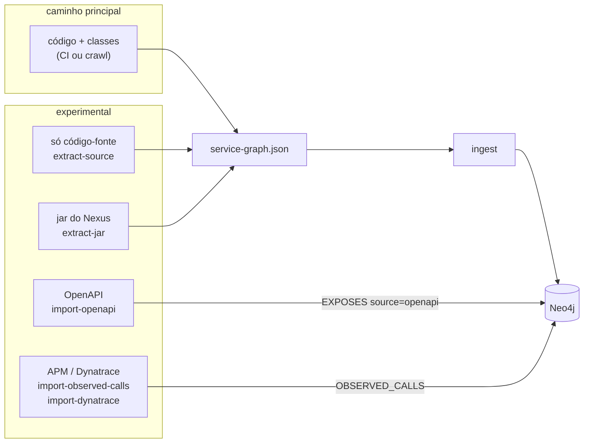

# Experimental: outras fontes para o grafo

O caminho principal é compilar e extrair, seja no CI ou no [crawl local](crawl.md). Esta página descreve
alternativas para quando isso não dá: projeto que não compila na máquina, serviço de outro time sem acesso ao
código, sistema legado que só tem um Swagger, ou dependências que só aparecem em produção.

Tudo aqui fica no pacote `experimental` do extrator e atrás do subcomando `experimental`. Nada disso é usado
pelo `crawl` nem pelo CI. Funciona, tem teste, mas foi pensado como ponto de partida.

```bash
java -jar graph-extractor.jar experimental
```



| Comando | Precisa de | Gera | Confiança |
|---|---|---|---|
| `extract-source` | só `src/main/java` e `resources` | `service-graph.json` | boa, com limites de resolução de tipos |
| `extract-jar` | jar da aplicação (e opcionalmente o `-sources.jar`) | `service-graph.json` | igual ao normal com fontes, parcial sem |
| `import-openapi` | spec OpenAPI/Swagger | endpoints de um serviço sem código | contrato declarado, não o real |
| `import-observed-calls` | JSON exportado de qualquer APM | chamadas observadas em runtime | alta para "existe", sem endpoint |
| `import-dynatrace` | URL do tenant e token | idem, direto da API | idem |

## 1. Sem compilar: extract-source

```bash
java -jar graph-extractor.jar experimental extract-source --project ~/work/conta-api --out conta-api.json
java -jar graph-extractor.jar ingest conta-api.json
```

Troca a leitura de bytecode (ClassGraph) por JavaParser. Serve para projeto que não compila local: parent POM
interno inacessível, dependência que só existe no Artifactory da empresa, JDK diferente.

Como funciona: as anotações (`@RestController`, `@FeignClient`, `@HttpExchange`, `@KafkaListener`,
`@QueryMapping` e afins) são lidas do código, e o nome qualificado de cada tipo é resolvido pelos imports, pelo
pacote e por um índice das classes do próprio projeto. Constantes (`Topics.ACCOUNT_OPENED`) são resolvidas pelo
mesmo índice. O resto do extrator (cadeias `RestClient`, `KafkaTemplate`, `StreamBridge`, GraphQL, propriedades)
é o mesmo.

O teste `SourceOnlyParityTest` roda os dois modos sobre as mesmas fixtures (clients HTTP, GraphQL, mensageria,
Maven multi-módulo e Gradle) e exige resultado idêntico. Nos dois serviços da POC o resultado também é igual.

Limites:

- Anotações compostas (uma `@MeuController` da empresa que tem `@RestController` dentro) não são reconhecidas.
  O modo bytecode reconhece esse caso no nível da classe.
- Constantes vindas de outra biblioteca (`TopicosCorporativos.CONTA_ABERTA` num jar) não são resolvidas. O tópico
  fica com o nome da expressão.

## 2. Pelo jar publicado: extract-jar

```bash
java -jar graph-extractor.jar experimental extract-jar \
  --jar emprestimo-api-2.3.1.jar \
  --sources emprestimo-api-2.3.1-sources.jar \
  --libs "empresa-*-client-*.jar" \
  --out emprestimo-api.json
```

Para serviço de outro time, ou quando a versão em produção importa mais do que a `main`: baixa o jar do Nexus e
extrai dele. Aceita Spring Boot fat jar (`BOOT-INF/classes`, `BOOT-INF/lib`) e jar comum.

- `--sources` aceita uma pasta ou o `-sources.jar`. Sem ele, só o que está no bytecode aparece: controllers,
  Feign, `@HttpExchange` com URL na anotação, listeners, beans do Stream. Cadeias `RestClient`/`WebClient`,
  `KafkaTemplate.send`, `StreamBridge.send` e a URL de `createClient(...)` ficam de fora, e o comando avisa.
- `--libs` inclui bibliotecas de dentro do `BOOT-INF/lib` na análise, por glob. É o caso típico de empresa: o
  client Feign de um serviço é publicado como `conta-client.jar` e usado por vários outros.
- Se o jar tem `git.properties` (plugin `git-commit-id`), commit e repositório vêm dele. Senão, o commit fica
  como `jar:<nome-do-arquivo>`.
- Entradas do zip que tentam sair da pasta temporária (`../`) são rejeitadas.

Nos dois serviços da POC, jar + sources dá exatamente o mesmo grafo do modo normal. Sem sources, o loan-service
perde a chamada `RestClient`, o client GraphQL e o `StreamBridge`, e o `@HttpExchange` aparece com alvo `unknown`
(a URL dele vem de `createClient`, que está no código).

Download do Nexus fica de fora de propósito (URL, autenticação e layout variam muito). Um `curl` com o token do
Nexus antes do comando resolve.

## 3. Contrato sem código: import-openapi

```bash
java -jar graph-extractor.jar experimental import-openapi \
  --service cadastro-legado \
  --spec https://cadastro-legado.interno/v3/api-docs
```

Para serviço que é chamado pelos seus, mas cujo código você não tem: legado, outro time, fornecedor. Lê OpenAPI 3
ou Swagger 2, em JSON ou YAML, de arquivo ou URL. O prefixo vem de `servers[0].url` (OpenAPI 3) ou `basePath`
(Swagger 2).

No grafo, o serviço fica com `contractSource: 'openapi'` e os endpoints com `EXPOSES {source: 'openapi'}`. A
diferença para quem consome:

- Sem o import, uma chamada para `cadastro-legado` aparece como "não indexado ainda".
- Com o import, o `find_contract_issues` passa a acusar como **erro** uma chamada para um endpoint que não está na
  spec ("does not expose it (according to its openapi contract)"), e o `impact_of_change` funciona para os
  endpoints desse serviço.

Rodar de novo substitui os endpoints importados antes. Se o serviço for extraído do código depois, os endpoints
do código substituem os da spec.

## 4. O que acontece em produção: chamadas observadas

O código mostra o que pode acontecer. O APM mostra o que acontece. As duas visões juntas pegam dois tipos de
problema:

- **dependência escondida**: o APM vê `A -> B`, mas o código de `A` não tem chamada para `B` (URL montada em
  runtime, lib interna, client gerado). O `find_contract_issues` dá **warning**.
- **código morto ou raro**: o código de `A` chama `B`, mas o APM nunca viu. Vira **info**. Só é avaliado para
  serviços que têm algum dado observado, para não gerar ruído de serviço que não está no APM.

No grafo vira `(:Service)-[:OBSERVED_CALLS {source, count, observedAt}]->(:Service)`, e o `service_overview` mostra
`observedCalls` e `observedCallers`.

### import-observed-calls (qualquer APM)

```bash
java -jar graph-extractor.jar experimental import-observed-calls \
  --file chamadas.json --source elastic-apm --names nomes.yml
```

Formato genérico, fácil de gerar de uma exportação do Elastic APM, Datadog, New Relic, Jaeger ou de uma query
no Kibana:

```json
[
  {"from": "Emprestimo API", "to": "conta-api", "count": 1520},
  {"from": "emprestimo-api", "to": "cadastro-legado", "count": 34}
]
```

Os nomes são normalizados (minúsculas, espaços viram `-`) e chamadas repetidas são somadas. O `--names` resolve o
caso comum de o nome no APM não bater com o `spring.application.name`. Mapear para vazio descarta a entrada
(banco, cache, serviço externo):

```yaml
"SpringBoot emprestimo-app": emprestimo-api
"conta-api-prd": conta-api
"oracle-cadastro": ""
```

Cada `--source` substitui só os dados dele, então dá para ter APMs diferentes lado a lado.

### import-dynatrace

```bash
export DT_API_TOKEN=dt0c01....     # escopo entities.read
java -jar graph-extractor.jar experimental import-dynatrace \
  --url https://abc123.live.dynatrace.com --names nomes.yml --dry-run
```

Lê a Smartscape pela API v2 (`/api/v2/entities?entitySelector=type("SERVICE")&fields=fromRelationships.calls`),
paginando por `nextPageKey`. O token vem de uma variável de ambiente (padrão `DT_API_TOKEN`, trocável com
`--token-env`), nunca de argumento, para não ficar no histórico do shell. `--dry-run` só lista as chamadas, sem
gravar, bom para acertar o `nomes.yml` primeiro.

O Dynatrace dá as chamadas entre serviços, mas não o endpoint nem a contagem nesse endpoint da API. Por isso
`count` fica vazio e o cruzamento é por serviço, não por endpoint.

## Ideias que ficaram só no papel

- **Plugin Maven no parent POM**: se a empresa tem um parent POM corporativo, um plugin nele roda a extração em
  todo build, sem mexer em pipeline de ninguém. É o caminho de maior alcance, mas depende de quem mantém o
  parent.
- **Regras para clients internos**: muitas empresas têm um starter próprio (`@ClienteCorporativo`,
  `EmpresaHttpClient`). O `AnnotationSource` e o `SourceScanner` já são os pontos de extensão; faltaria um arquivo
  de regras (anotação, atributo da URL, atributo do path) em vez de código.
- **Webhook de push**: um serviço escutando webhooks do GitLab dispara o crawl só do projeto que mudou.
  Precisa de alguém com permissão para cadastrar o webhook, mas não de mexer no pipeline.
- **Endpoint por chamada observada**: APMs com trace distribuído (Elastic, Jaeger, Tempo) têm método e rota em
  cada span. Com isso daria para ligar `OBSERVED_CALLS` a `Endpoint`, não só a `Service`.
- **Consumo Kafka observado por offset lag**: o `kafka-runtime` já lê os grupos. Guardar o lag daria "consumidor
  existe mas está parado há dias".
