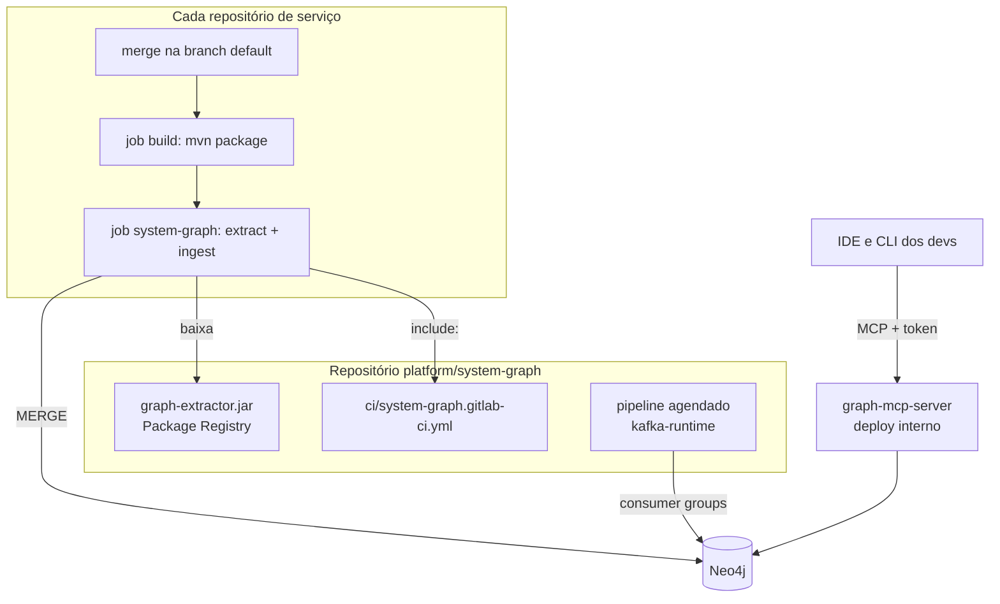

# Levando para a empresa (GitLab)

Este documento descreve como a POC viraria algo usado de verdade num ambiente com vários repositórios Spring
Boot no GitLab.

## Visão do pipeline



## Passos

### 1. Repositório da plataforma

Um repositório (por exemplo `platform/system-graph`) com o `extractor`, o `graph-mcp-server` e o template de CI.
O pipeline dele publica o `graph-extractor.jar` no Package Registry do GitLab e a imagem do MCP server no
Container Registry.

### 2. Job em cada serviço

Cada serviço inclui o template e estende o job. São poucas linhas no `.gitlab-ci.yml`, como em
[`ci/example-service.gitlab-ci.yml`](../ci/example-service.gitlab-ci.yml):

```yaml
include:
  - project: platform/system-graph
    ref: main
    file: ci/system-graph.gitlab-ci.yml

system-graph:
  extends: .system-graph
```

O job roda só na branch default, compila, extrai, grava no Neo4j e guarda o `service-graph.json` como artefato.
Variáveis `NEO4J_URI`, `NEO4J_USER` e `NEO4J_PASSWORD` ficam como CI/CD variables no grupo, mascaradas.

A adoção pode ser gradual. Serviços sem o job aparecem como `indexed: false` quando outros os chamam, e as tools
avisam isso.

### 3. Runtime do Kafka

Um pipeline agendado (por exemplo de hora em hora) roda `kafka-runtime` contra o cluster de cada ambiente. É o
que revela consumidores que existem em produção mas não estão no código indexado: serviços legados, scripts,
times de dados.

### 4. MCP server

Deploy como qualquer outro serviço Spring Boot. Configuração em cada repositório com `.mcp.json` versionado:

```json
{
  "mcpServers": {
    "system-graph": {
      "type": "http",
      "url": "https://system-graph.interno.empresa/mcp",
      "headers": { "Authorization": "Bearer ${SYSTEM_GRAPH_TOKEN}" }
    }
  }
}
```

O Claude Code expande `${SYSTEM_GRAPH_TOKEN}` a partir do ambiente do dev. Autenticação ainda precisa ser
adicionada ao MCP server (Spring Security com token ou OAuth via GitLab).

### 5. CLAUDE.md ou equivalente

Um trecho padrão em cada repositório dizendo para consultar `impact_of_change` antes de mexer em contrato, como
o [`CLAUDE.md` do account-service](../account-service/CLAUDE.md). Para Cursor e Copilot, o mesmo texto vai no
arquivo de regras de cada ferramenta.

## Padronizações que aumentam a precisão

- **Nome da propriedade de URL**: `services.<nome-do-serviço>.url`. Resolve o serviço alvo mesmo quando a URL
  local é `localhost`.
- **`group.id` igual ao `spring.application.name`**: permite cruzar código e cluster.
- **HTTP Interfaces (`@HttpExchange`)** para clients novos: tornam a extração de chamadas REST exata. Rodam em
  cima de `RestClient` e `WebClient`, que já são usados.
- **Tópicos em constantes ou propriedades**, nunca montados em runtime.

## Como medir se vale a pena

Antes de expandir, vale um teste com 3 ou 4 serviços que conversam muito entre si:

- Pegar MRs antigos que quebraram outro serviço e perguntar ao assistente, com o grafo, se a mudança teria
  impacto. Contar acertos.
- Rodar `find_contract_issues` e ver quantos problemas reais aparecem, como o `monthlyIncome` desta POC.
- Comparar o grafo com o que o time acha que é a arquitetura. Diferenças costumam ser dependências esquecidas.

## Próximos passos técnicos

- Suporte a `@HttpExchange` e `@FeignClient` no extrator.
- Comparação de schema em mais de um nível (DTOs aninhados, listas).
- Schema de resposta REST: comparar o DTO do client com o DTO retornado pelo controller, como já é feito para eventos.
- Profiles do Spring, para ter o grafo por ambiente.
- Autenticação no MCP server e usuário Neo4j só de leitura.
- Fluxo de revisão de notas (tool ou tela simples para aprovar `pending`).
